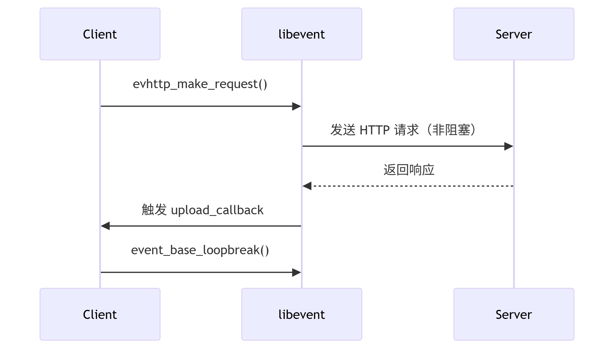

#### client/Storage.hpp:

##### 主要功能实现:实现文件存储与上传功能，监控指定目录下的文件变化，并将需要上传的文件通过HTTP协议发送到服务器
- 关于upload_back函数

```
upload_callback 是一个静态回调函数，当 HTTP 上传请求完成（成功或失败）时被触发。

主要逻辑：

检查请求对象 req 是否有效（是否为 nullptr）。

获取 HTTP 响应状态码，判断上传是否成功（状态码 200 表示成功）。

终止事件循环（event_base_loopbreak），通知主程序请求处理完成。

2. libevent 的核心逻辑
(1) 异步事件驱动
libevent 是一个基于事件驱动的网络库，通过 事件循环（event loop） 监听文件描述符（如 Socket）、定时器或信号等事件。

回调机制：当某个事件（如 HTTP 请求完成）发生时，libevent 自动调用注册的回调函数（这里是 upload_callback）。

(2) 关键对象
event_base：事件循环的核心对象，管理所有注册的事件。

evhttp_request：封装 HTTP 请求和响应的结构体，包含状态码、头部、正文等信息。

(3) 流程解析
初始化 HTTP 请求
在代码的其他部分（未展示），会通过 evhttp_make_request() 发起 HTTP 上传请求，并注册回调函数 upload_callback。

cpp
evhttp_make_request(connection, req, EVHTTP_REQ_POST, "/upload", upload_callback, event_base);
事件循环运行
主程序调用 event_base_dispatch() 或 event_base_loop() 启动事件循环，等待事件触发。

回调触发

当服务器返回响应时，libevent 检测到 Socket 可读事件，调用 upload_callback。

回调函数内通过 evhttp_request_get_response_code() 获取状态码，并设置全局标志 if_upload_success。

终止事件循环
event_base_loopbreak(bev) 强制退出事件循环，使主程序继续执行后续逻辑。

3. 代码逐行解析
cpp
static void upload_callback(struct evhttp_request* req, void* arg) {
    cout << "http_client_cb" << endl;
    event_base* bev = (event_base*)arg;  // 从参数中获取事件循环对象
arg 是用户传入的上下文参数，这里传递了 event_base 对象，用于控制事件循环。

cpp
    if (req == nullptr) {
        int errcode = EVUTIL_SOCKET_ERROR();
        cerr << "socket error " << evutil_socket_error_to_string(errcode) << endl;
        return;
    }
检查请求对象有效性：如果 req 为 nullptr，说明底层 Socket 出错（如连接被拒绝、超时等），打印错误信息后退出。

cpp
    int rsp_code = evhttp_request_get_response_code(req);  // 获取 HTTP 状态码
    if (rsp_code != HTTP_OK) {  // 非 200 状态码表示失败
        cerr << "response:" << rsp_code << endl;
        if_upload_success = false;
    } else {
        if_upload_success = true;  // 200 表示成功
    }
处理响应状态码：

HTTP_OK（200）表示上传成功，设置 if_upload_success = true。

其他状态码（如 404、500）表示失败，设置 if_upload_success = false。

cpp
    event_base_loopbreak(bev);  // 强制退出事件循环
}
终止事件循环：通知主程序 HTTP 请求处理完成，继续执行后续代码。


req 的角色
来源：当客户端发起 HTTP 请求（如上传文件）后，服务器返回响应时，libevent 会将响应信息封装到 evhttp_request 结构体中，并通过回调函数 upload_callback 的 req 参数传递给用户。

内容：

响应状态码（如 200、404）

响应头（Headers）

响应正文（Body，如果有）

可能的错误信息（如连接失败时 req 为 nullptr）

2. 为什么是“输入参数”？
只读性：回调函数中通过 req 读取响应信息，而非修改它。例如：

cpp
int rsp_code = evhttp_request_get_response_code(req); // 读取状态码
生命周期：req 由 libevent 内部管理，回调函数执行完毕后会被自动释放，用户无需手动销毁。

3. 对比“写入参数”
写入参数：通常指需要用户填充数据的参数（如发起 HTTP 请求时的请求对象）。
例如，在发起请求时，会创建一个 evhttp_request 对象并设置请求方法、路径、头部等：

cpp
evhttp_request* request = evhttp_request_new(callback, event_base);
evhttp_add_header(request->output_headers, "Content-Type", "text/plain");
这里的 request 是“写入参数”，而回调函数中的 req 是“读出参数”。


```

**upload函数：**
**设置请求头（Header）**
evkeyvalq* output_headers = evhttp_request_get_output_headers(req);
evhttp_add_header(output_headers, "Host", server_ip_g.c_str());
evhttp_add_header(output_headers, "FileName", fu.FileName().c_str());
evhttp_add_header(output_headers, "Content-Type", "application/octet-stream");

- 为什么需要设置请求头？

协议规范：HTTP 协议要求必须包含 Host 头（尤其是 HTTP/1.1）。

业务需求：(业务逻辑控制)

**FileName：告知服务器保存的文件名。**

**Content-Type：声明上传内容为二进制流（application/octet-stream）。**

**StorageType：自定义存储策略（如 low 或 deep）。**

4. 填充请求体（Body）
cpp
std::string body;
fu.GetContent(&body);  // 读取文件内容
evbuffer* output = evhttp_request_get_output_buffer(req);
evbuffer_add(output, body.c_str(), body.size());  // 将文件内容写入请求体
evbuffer：libevent 的高效缓冲区，支持零拷贝操作。


**(1)请求发送后，控制权交给 event_base_dispatch。**

**(2)服务器响应到达时，触发 upload_callback。**

**(3)回调中通过 event_base_loopbreak 退出事件循环。**
